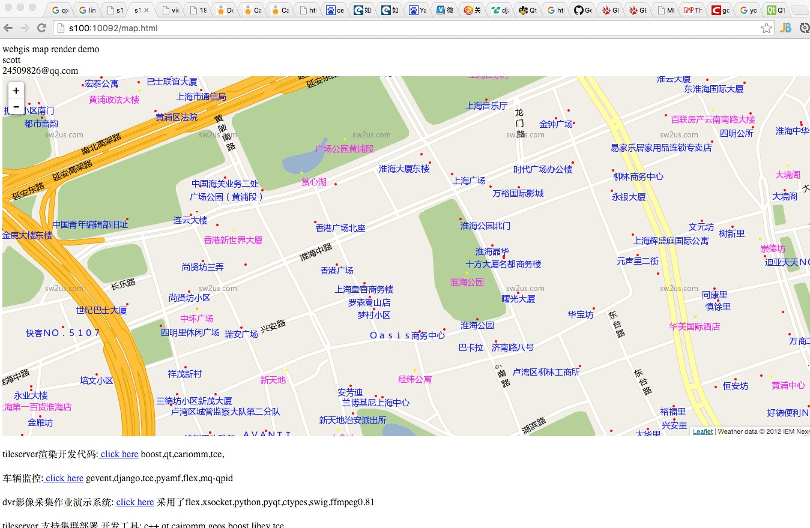

MapServer
=========

### 地图绘制服务器

渲染效果可见:  http://wallizard.com:10092/

  mapserver提供地理网格图形绘制服务(tile renderring),通信部分采用tce的RPC调用(见 wms-server).最早采用qt作为图形库，但其在windows平台下多线程(multithread)没问题，到了linux却无法工作，原因在于qt的图形部件类都必须在ui主线程工作，导致多线程工作在signal/slot之后变成了但线程处理，性能不佳，最终还是选用cairo，在64bit系统下表现可以.
	
  mapserver本是个多年前开始的项目，最早在2009做出了第一个版本，当初的目的是为了一个wince的导航地图而启动开发计划。

  mapserver也是个人爱好项目，期间不乏颇多的不合理和混乱。
  
  mapserver的windows版本已经被停止，linux的版本基于cairo和qt，如果需移植到android和ios，也需要一定的工作量来替换掉工程中使用的一些图形ui类和基础数据包装类型

docker 
=====

	地图系统由若干个服务构成，已经打包成 docker 镜像  sw2us_webgis_0.2.1.docker 
	

部署MapServer
=============

1. github下载docker镜像
	http://pan.baidu.com/s/1bn7cXVh
	
2. 运行docker并加载 镜像  

<pre>
   gzip -d sw2us_webgis_0.2.2.docker.gz
   docker load -i sw2us_webgis_0.2.2.docker
   docker run --name webgis0.2  -itd -v /home:/data -p 10092:8080 -p 10093:4004 webgis:0.2.2 /bin/bash

</pre>

3. 运行mapserver

<pre>
   docker exec -it webgis0.2 bash 
   cd /home/sw2us
   bash ./start.sh
</pre>	

### Image Download
1. 2015.11.27 <a href="http://pan.baidu.com/s/1bn7cXVh">sw2us_webgis_0.2.2.docker.tar.gz</a>      

环境
====
* centos 6.+
* libcairo , cairomm
* eclipse+cdt
* libtce
* qt4-devel
* mongoose-httpserver
* docker-1.7.1

相关工程代码
======
http://smart.yanguish.com:10092/www/static/projects

影像采集应用
======
-dvr 采集处理
高德工作是在上海数据部门，负责数据本地客户化和创新项目开发。 

 http://smart.yanguish.com:10092/www/static/projects/dvr/dvr_demo.html
 
 
 
 
-文档 

 http://smart.yanguish.com:10092/www/static/projects/dvr/doc/

